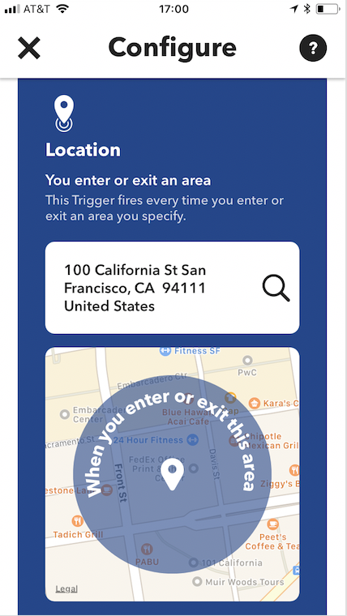
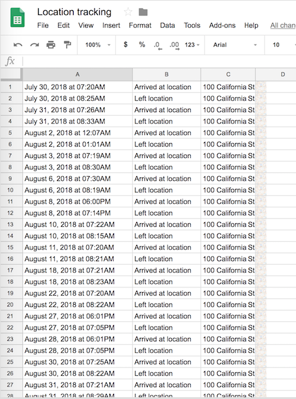
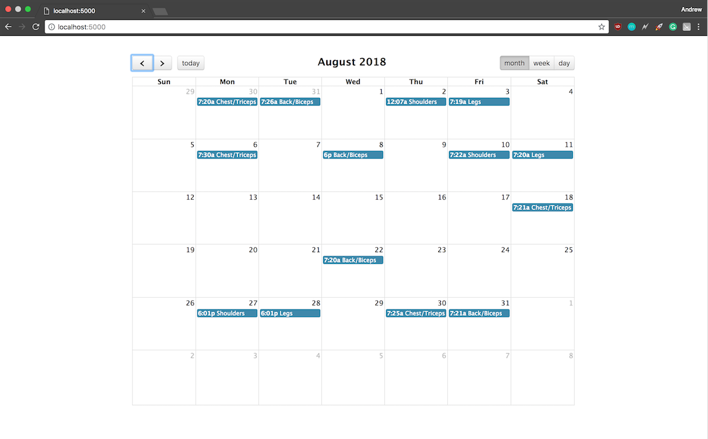

# Habit-Tracker
Utilize applets on IFTT to track location & time data around a specific geofence. Location and time data are then recorded as events on a fully functional calendar.

## Future functionality
* Integrate with Google Calendar. Instead of creating stand-alone calendar, verify if activity was completed and if not, remove listing from GCal.
* Color code entries based on missed days.
* Display metrics such as average time spent at location and if there are trends such as average time spent at location per day/week/month, favored times in the week or month etc.


## Workflow

#### Download IFTT on App Store or Google Play. Install 'Log how much time you spend at specific locations like the office or home in a spreadsheet' applet. Set geo-fence to location of choice.
<p align="center">
  
</p>

#### Verify data is being recorded into Google Sheet correctly.
<p align="center">
  
</p>

#### Run Habit-Tracker Web App to see results.
<p align="center">
  
</p>

## In order to run

Create a virtualenv to run app in:

```shell
virtualenv habit_tracker
cd habit_tracker
```

Activate virtualenv:

```shell
source bin/activate
```

Install Flask in your virtualenv:

```shell
pip install Flask
```

Update events data and then run flask web app:

```shell
python update_data.py
python main.py
```

Check out updated web calendar on your browser of choice at localhost:5000


